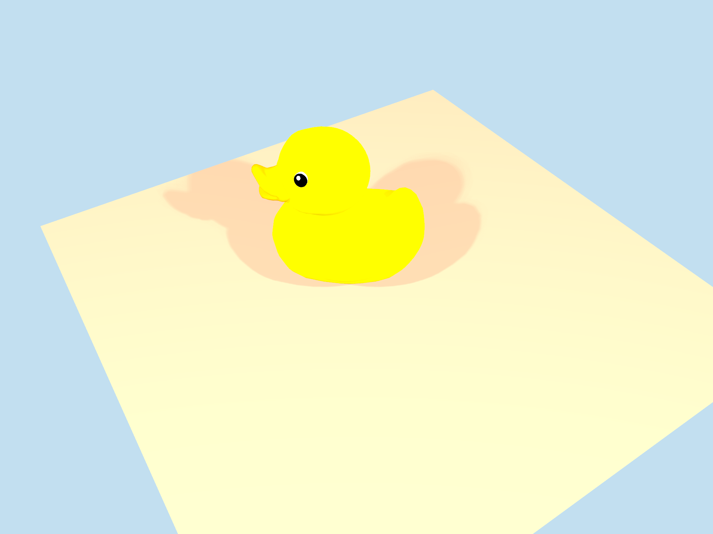

# glTF example



## Usage

### Duck

```sh
cargo run -p examples_gltf -F wgpu -F duck --no-default-features
```

### Cylinder Engine

```sh
cargo run -p examples_gltf -F wgpu -F cylinder_engine --no-default-features
```

### Avocado

```sh
cargo run -p examples_gltf -F wgpu -F avocado --no-default-features
```

## Thanks

We are using [glTF Sample Models](https://github.com/KhronosGroup/glTF-Sample-Models) in example.
